# Output snippets

## Basics of Java

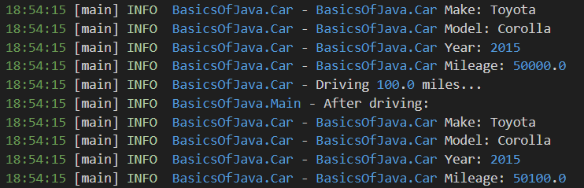

## Basic Datatypes

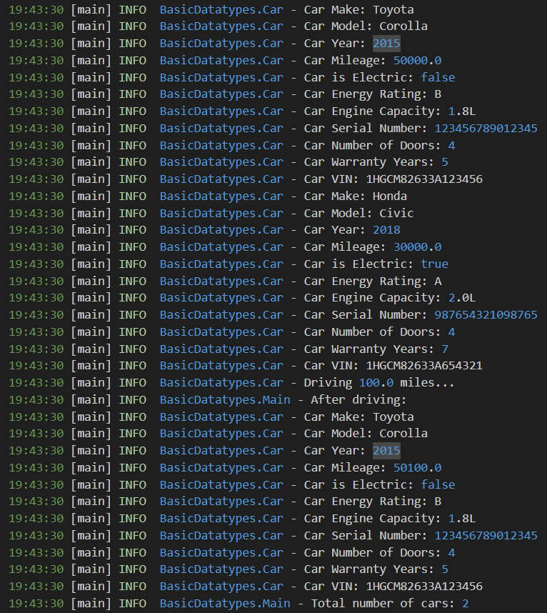

## Loop Control

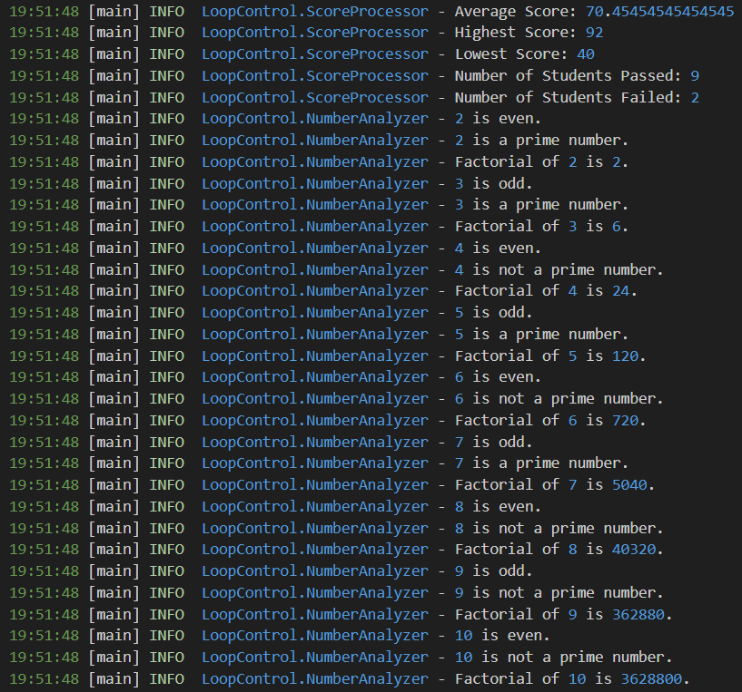

## Strings and Arrays

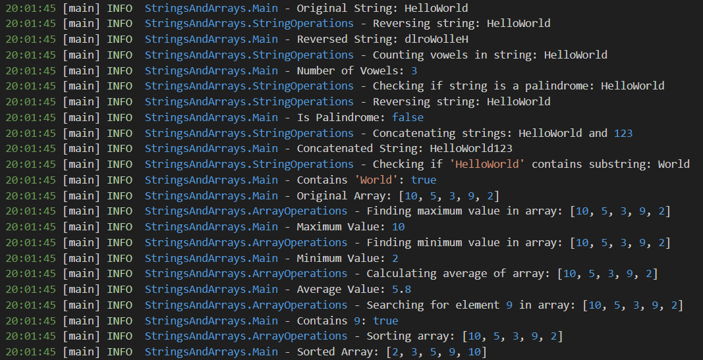

## OOPS Concepts

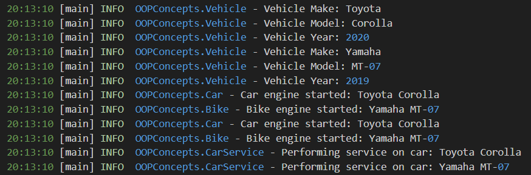

## Collection Operations

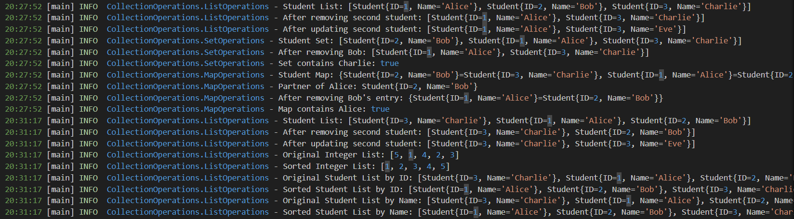

## Multithreading Concepts

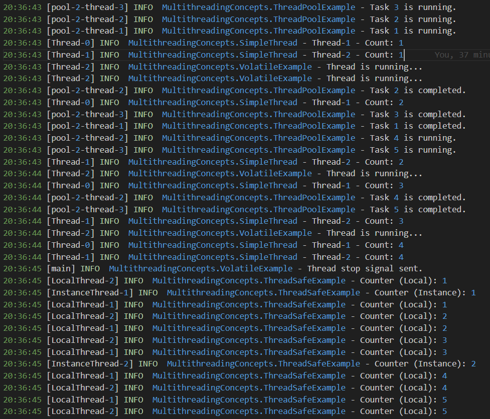

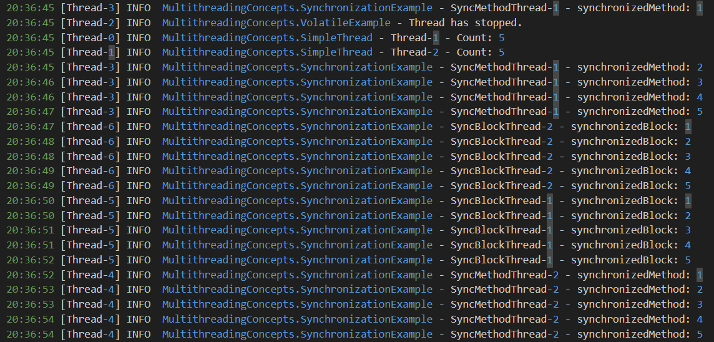

## JSON Handling

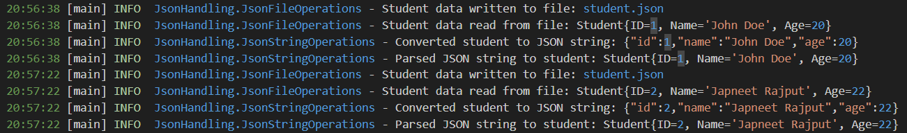

## XML Parsing

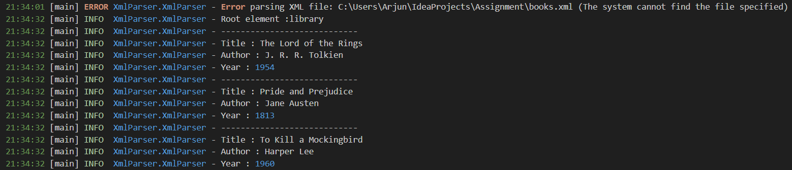

## File operations

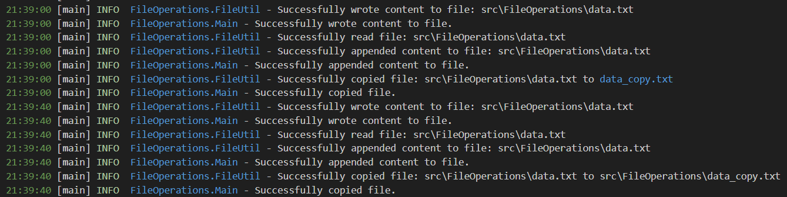

## JDBC

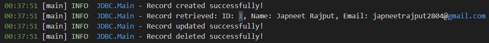
